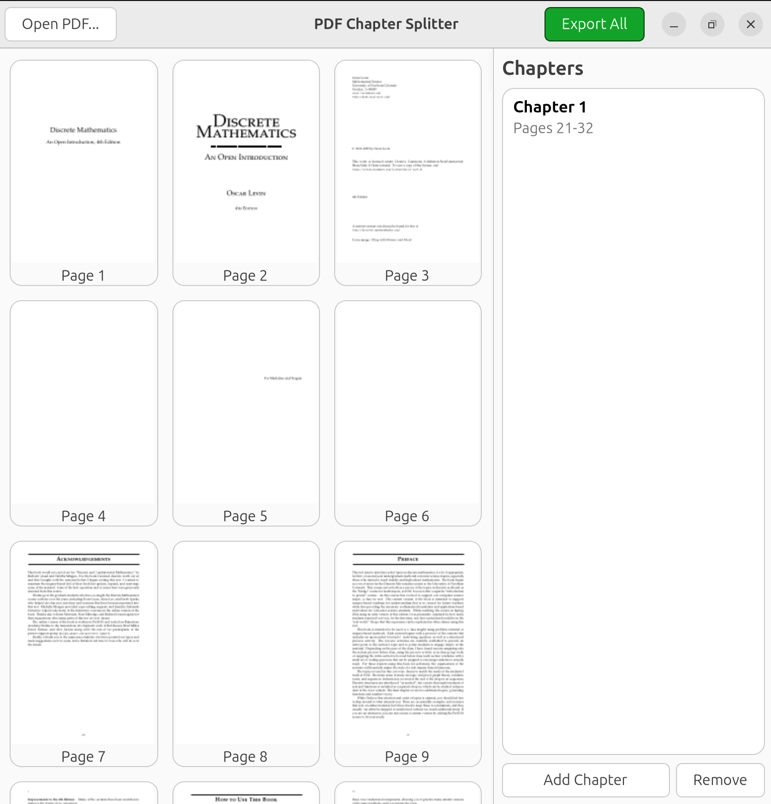

# PDF Chapter Splitter

A small GTK4 desktop app for splitting a PDF textbook into per-chapter PDF
files. Load a book, page through real rendered thumbnails, select page
ranges, and export each chapter as its own PDF.



## Features

- **Open PDF** — pick any local PDF; every page renders as a real thumbnail
  in a scrollable grid.
- **Range selection** — click a page, then Shift+click another to select
  everything in between. Click a selected page again to clear the selection.
- **Chapters** — click **Add Chapter** to turn the current selection into a
  chapter entry in the sidebar (`Chapter 1: Pages 21-32`, etc). **Remove**
  deletes a chapter and renumbers the rest.
- **Export All** — writes each chapter to its own `Chapter_01.pdf`,
  `Chapter_02.pdf`, ... file.
- A loading dialog with a spinner and progress bar covers the (synchronous)
  load-and-render step so the app never looks frozen on a long book.

## Building

Requires GTK4, poppler-glib, and Meson/Ninja.

```bash
sudo apt-get install -y meson ninja-build libgtk-4-dev libpoppler-glib-dev check
```

```bash
meson setup build
meson compile -C build
```

## Running

```bash
./build/src/pdf-chapter-splitter            # opens with an empty grid; use Open PDF...
./build/src/pdf-chapter-splitter book.pdf   # loads book.pdf immediately
```

## Testing

The PDF-handling core (`src/model`) has an automated unit test suite built
on Check, covering loading, page counts, thumbnail rendering, and page-range
export (including error cases like invalid ranges).

```bash
meson test -C build -v
```

## Architecture

The app is split into three layers:

- **`src/model`** — `PdfDoc`: wraps a loaded PDF via poppler-glib. No GTK
  dependency beyond `GdkPixbuf`; fully unit-testable in isolation.
- **`src/view`** — `MainWindow`: builds and lays out all widgets (thumbnail
  grid, chapter sidebar, loading dialog). No PDF-handling logic.
- **`src/controller`** — `AppController`: wires the two together — button
  clicks, page-range selection, chapter bookkeeping, and calling into the
  model to load and export.

```
src/
├── main.c
├── model/       PdfDoc: load, render thumbnails, export page ranges
├── view/        MainWindow: widget layout only
└── controller/  AppController: wires model <-> view, owns app state
```
